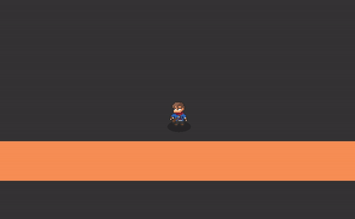

## Gameplay so far

### Attack with dust particles

### Gore

###### Blood Particles

###### Gibs

### Enemy Behaviour

###### Crowd navigation

###### Attack and Fleeing

### Phong and Shadow Maps

## Acknowledgments

* [Steering Behaviors For Autonomous Characters](https://www.red3d.com/cwr/steer/gdc99/) 
* [devlkore's steering behaviour scripts for GML](https://www.reddit.com/r/gamemaker/comments/5sztky/example_steering_behaviours_grid_based_flocking/)
* [PixelatedPope's FSM scripts for GML](https://www.reddit.com/r/gamemaker/comments/353aq6/tutorialexample_finite_state_machines_the_most/)
